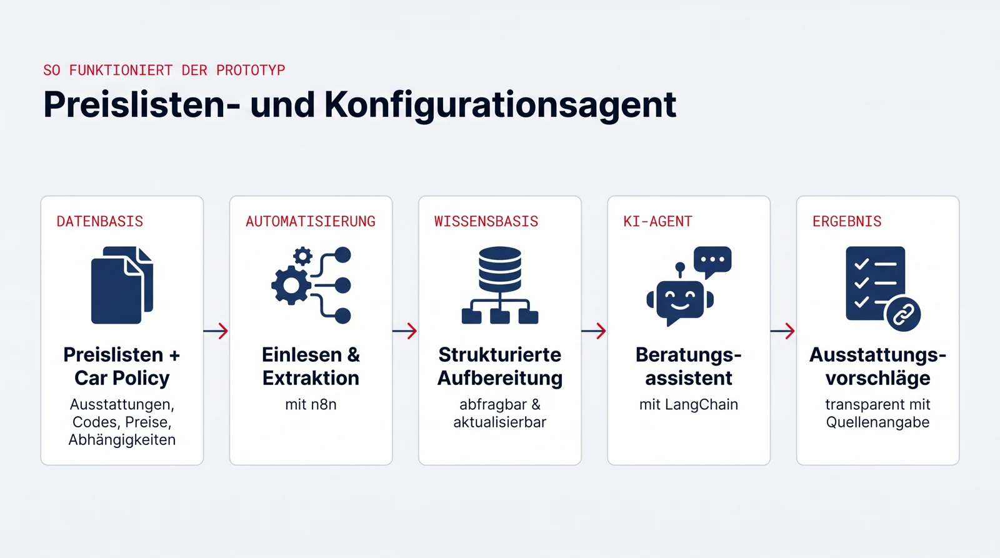

## Eckdaten

::: {.eckdaten}
| | |
|---|---|
| **Art** | Interdisziplinäres Projekt |
| **SWS/ECTS** | 5 SWS / 12 ECTS |
| **Kategorie** | Management und IT (338025-338027) |
| **Sprache** | Deutsch |
| **Projektpartner** | [Mercedes-Benz](https://www.mercedes-benz.com/) |
| **Betreuung** | Prof. Dr. Jan Kirenz |
:::

## Worum es geht

Ziel des Projekts ist es, Potenziale von Agentic AI für den internen Wissenszugang, die operative Unterstützung und die Optimierung von Vertriebsprozessen im Bereich Digitalisierung Mercedes-Benz Members aufzuzeigen und praxisnah nutzbar zu machen. Mercedes-Benz bringt den Anwendungsfall, die Daten und das Domänenwissen ein, wir entwickeln gemeinsam einen funktionsfähigen Prototypen und bewerten dessen Nutzen.

## Der Use Case: Preislisten- und Konfigurationsagent

Mercedes-Benz stellt ausgewählte Fahrzeug-Preislisten für klar definierte Baureihen sowie die zugehörige Car Policy bereit. Die Preislisten enthalten verfügbare Ausstattungen, dreistellige Sonderausstattungscodes, Preisinformationen und dokumentierte Abhängigkeiten.

Auf dieser abgegrenzten Datenbasis entwickeln Sie mit n8n und LangChain einen funktionsfähigen Prototypen. Dieser soll die bereitgestellten Dokumente automatisiert einlesen, relevante Inhalte strukturiert aufbereiten und intelligent abfragbar machen. Darüber hinaus soll der Agent Mitarbeitende bei der schrittweisen Zusammenstellung von Fahrzeugausstattungen unterstützen und seine Vorschläge transparent auf die verwendeten Quellen zurückführen.

Ziel ist es zu bewerten, ob sich statische Preislisten und Regelwerke in einen nachvollziehbaren Beratungsassistenten überführen lassen.

{.infografik fig-alt="Infografik: Preislisten und Car Policy werden mit n8n eingelesen, strukturiert aufbereitet und über einen LangChain-Agenten als Ausstattungsvorschläge mit Quellenangabe abfragbar gemacht."}

## Geplanter Umfang

- Automatisiertes Einlesen und Extrahieren relevanter Inhalte aus den Preislisten
- Strukturierte Zuordnung von Ausstattungen, Sonderausstattungscodes und Preisen
- Abbildung der in den Preislisten dokumentierten Abhängigkeiten
- Einbeziehung der Car Policy mit verpflichtenden Ausstattungen je Modelltyp
- Interaktive Abfrage der bereitgestellten Informationen
- Iterative Entwicklung von Ausstattungsvorschlägen für definierte Baureihen
- Transparente Anzeige der jeweils verwendeten Quellen
- Qualitätsbewertung anhand definierter fachlicher Prüffälle
- Prüfung von Quellenbezug, Konsistenz und Berücksichtigung der Car Policy
- Einfacher Prozess zum Einspielen neuer oder aktualisierter Preislisten

::: {.callout-note appearance="simple"}
## Klare Abgrenzung
Der Prototyp ist kein produktiver Fahrzeugkonfigurator und gibt keine verbindliche Garantie für Baubarkeit oder Bestellbarkeit. Ziel ist neben einem funktionsfähigen Prototyp vor allem eine belastbare Entscheidungsgrundlage für eine mögliche Weiterentwicklung.
:::

## Ablauf im Semester

- **4 Blocktage vor Beginn der Vorlesungszeit:** Einführung in Agentic AI, die verwendeten Frameworks und die Aufgabenstellung des Partners.
- **Wöchentliche Termine** während der Vorlesungszeit: Arbeitsphasen im Team, Reviews und Abstimmungen mit dem Projektpartner.
- Am Semesterende präsentieren Sie Ihre Prototypen und die Evaluationsergebnisse.

## Technologien und Frameworks

Womit Sie arbeiten werden (zum Einlesen vor Projektstart):

- **[n8n](https://docs.n8n.io/):** Workflow-Automatisierung, verbindet Dokumenten-Pipeline, Agent und Schnittstellen
- **[LangChain](https://python.langchain.com/docs/introduction/):** Framework für LLM-Anwendungen, Dokumentenverarbeitung und Retrieval (RAG)
- **LLM-APIs:** z.B. [Anthropic Claude](https://docs.anthropic.com/) oder [OpenAI](https://platform.openai.com/docs/)
- **Python** für die Prototyp-Entwicklung

Sie müssen keines dieser Frameworks vorab beherrschen, die Einführung erfolgt in den Blocktagen.

## Voraussetzungen

- Affinität für neue Technologien und Interesse an KI-Anwendungen im Unternehmenskontext
- Grundkenntnisse in Python sind hilfreich, aber keine Bedingung
- Bereitschaft zur Teamarbeit und zur Abstimmung mit einem Unternehmenspartner

## Was Sie lernen

- Agentenbasierte KI-Systeme konzipieren, prototypisch umsetzen und kritisch bewerten
- Dokumentenverarbeitung und Retrieval (RAG) mit LangChain praktisch einsetzen
- Workflows mit n8n automatisieren und in bestehende Prozesse integrieren
- Ergebnisse anhand fachlicher Prüffälle evaluieren und vor einem Unternehmenspartner präsentieren

## Bewerbung und Kontakt

Die Vorstellung der Projekte und die Platzvergabe laufen über den Moodle-Kurs der Fakultät. Bei Fragen vorab: [kirenz@hdm-stuttgart.de](mailto:kirenz@hdm-stuttgart.de)
