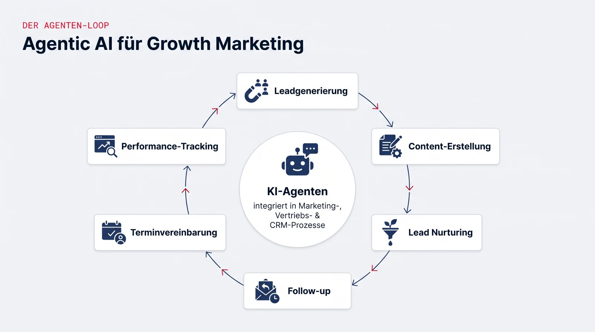

## Eckdaten

::: {.eckdaten}
| | |
|---|---|
| **Art** | Interdisziplinäres Projekt |
| **SWS** | 5 |
| **Kategorie** | Management und IT (338025-338027 bzw. 338085-338087), Psychologie (338110-338115) |
| **Projektpartner** | [SiMa.ai](https://sima.ai/) |
| **Betreuung** | Prof. Dr. Jan Kirenz |
:::

## Worum es geht

Ziel des Projekts ist es, Potenziale von Agentic AI für datengetriebenes Growth Marketing aufzuzeigen und praxisnah nutzbar zu machen.

Dazu werden aktuelle Best-Practice-Ansätze analysiert und funktionsfähige Prototypen entwickelt, die Aufgaben wie Leadgenerierung, Content-Erstellung, Lead Nurturing, Follow-up, Terminvereinbarung und Performance-Tracking agentenbasiert unterstützen oder automatisieren.

Der Fokus liegt auf der nahtlosen Einbindung agentenbasierter KI in bestehende Marketing-, Vertriebs- und CRM-Prozesse sowie auf der Evaluation ihrer Auswirkungen auf Effizienz, Sichtbarkeit, Personalisierungsgrad, Conversion-Potenziale und Ergebnisqualität.

{.infografik fig-alt="Infografik: KI-Agenten, integriert in Marketing-, Vertriebs- und CRM-Prozesse, unterstützen einen Kreislauf aus Leadgenerierung, Content-Erstellung, Lead Nurturing, Follow-up, Terminvereinbarung und Performance-Tracking."}

## Was bringt es mir?

Marketing und Vertrieb gehören zu den Bereichen, in denen KI-Automatisierung am schnellsten Einzug hält, entsprechend gefragt sind Leute, die beides verstehen: die Fachseite (Leads, Funnel, CRM) und die technische Umsetzung mit Agenten. Nach dem Projekt haben Sie genau diese Kombination an einem realen Fall geübt und ein konkretes Referenzprojekt für Bewerbungen, egal ob Richtung Marketing, Produktmanagement oder Entwicklung.

## Ablauf im Semester

- **4 Blocktage vor Beginn der Vorlesungszeit:** Einführung in Agentic AI, die verwendeten Frameworks und die Aufgabenstellung des Partners.
- **Wöchentliche Termine** während der Vorlesungszeit: Arbeitsphasen im Team, Reviews und Abstimmungen mit dem Projektpartner.
- Am Semesterende präsentieren Sie Ihre Prototypen und die Evaluationsergebnisse.

## Technologien und Frameworks

Womit Sie voraussichtlich arbeiten werden (was die Werkzeuge können und warum sie sich lohnen, steht auf den verlinkten Seiten):

- **[n8n](../../technologien/n8n.qmd):** automatisiert Lead-Nurturing- und Follow-up-Strecken und verbindet die Agenten mit dem Marketing-Stack
- **[LLM-APIs](../../technologien/llm-apis.qmd):** Claude oder GPT als Basis der Agenten
- **[LangChain](../../technologien/langchain.qmd)** oder vergleichbare Agent-Frameworks
- **Marketing-Stack:** Anbindung an CRM- und Marketing-Tools über APIs und Webhooks
- **Python** für die Prototyp-Entwicklung

Sie müssen keines dieser Werkzeuge vorab beherrschen, die Einführung erfolgt in den Blocktagen.

## Voraussetzungen

- Interesse an Marketing, Vertrieb und datengetriebenen Prozessen
- Affinität für neue Technologien; Grundkenntnisse in Python sind hilfreich, aber keine Bedingung
- Bereitschaft zur Teamarbeit und zur Abstimmung mit einem Unternehmenspartner

## Was Sie lernen

- Agentenbasierte KI-Systeme für Marketing- und Vertriebsprozesse konzipieren und prototypisch umsetzen
- LLM-APIs, Agent-Frameworks und Automatisierungstools praktisch einsetzen
- Wirkung von KI-Automatisierung messen und bewerten (Conversion, Personalisierung, Effizienz)
- Ergebnisse strukturiert aufbereiten und vor einem Unternehmenspartner präsentieren

## Bewerbung und Kontakt

Die Vorstellung der Projekte und die Platzvergabe laufen über den Moodle-Kurs der Fakultät. Bei Fragen vorab: [kirenz@hdm-stuttgart.de](mailto:kirenz@hdm-stuttgart.de)
