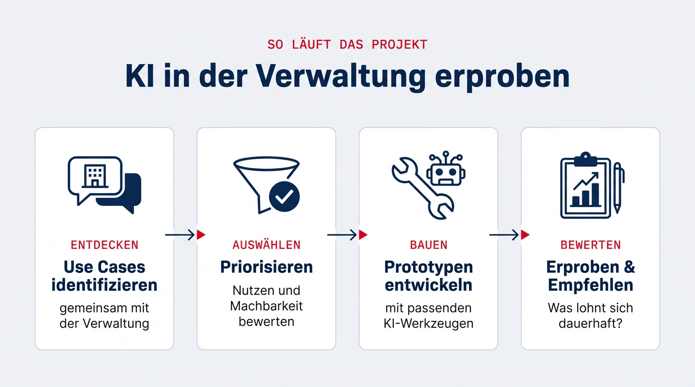

## Eckdaten

::: {.eckdaten}
| | |
|---|---|
| **Art** | folgt |
| **SWS** | folgt |
| **Kategorie** | folgt |
| **Sprache** | Deutsch |
| **Projektpartner** | Hochschulverwaltung der HdM |
| **Betreuung** | [Prof. Dr. Stephan Wilczek](https://hdm-stuttgart.de/person/wilczek/), [Prof. Dr. Jan Kirenz](https://hdm-stuttgart.de/person/kirenz/) |
:::

## Worum es geht

In diesem Projekt erproben Sie [Agentic AI](../../glossar.qmd#agentic-ai){.glossar} in der Verwaltung, am Beispiel der eigenen Hochschule: Gemeinsam mit Bereichen der HdM-Verwaltung untersuchen wir, wo KI Verwaltungsprozesse sinnvoll unterstützen kann.

Sie identifizieren zusammen mit den Verwaltungsbereichen konkrete Use Cases, priorisieren sie und setzen ausgewählte Fälle mit passenden Technologien prototypisch um. Am Ende steht eine Bewertung, was funktioniert, was nicht, und was sich für den dauerhaften Einsatz lohnt.

{.infografik fig-alt="Infografik: Projektablauf in vier Schritten. Use Cases identifizieren gemeinsam mit der Verwaltung, Priorisieren nach Nutzen und Machbarkeit, Prototypen entwickeln mit passenden KI-Werkzeugen, Erproben und Empfehlen."}

## Berufliche Relevanz

Verwaltung ist eines der größten Anwendungsfelder für KI überhaupt, von Hochschulen über Behörden bis zu den Verwaltungsabteilungen jedes Unternehmens. In diesem Projekt lernen Sie den kompletten Weg: aus echten Prozessen Use Cases ableiten, mit den Fachleuten priorisieren, [Prototypen](../../glossar.qmd#prototyp){.glossar} bauen und die Ergebnisse bewerten. Diese Fähigkeiten, KI-Potenziale erkennen, bewerten und in funktionierende Lösungen übersetzen, sind in jeder Organisation gefragt, ob Behörde, Konzern oder Start-up.

## Mögliche Themenfelder

Die konkreten Use Cases werden zum Projektstart gemeinsam mit der Verwaltung festgelegt. Typische Kandidaten in der Hochschulverwaltung sind zum Beispiel:

- Beantwortung wiederkehrender Anfragen von Studierenden und Mitarbeitenden
- Interne Wissenssuche über Ordnungen, Formulare und Dokumentationen
- Automatisierte Verarbeitung von Dokumenten und Formularen
- Unterstützung bei Berichten und Auswertungen

## Technologien und Frameworks

Der Technologie-Stack wird passend zu den ausgewählten Use Cases festgelegt. Voraussichtlich arbeiten Sie mit:

- **[LLM-APIs](../../technologien/llm-apis.qmd):** Sprachmodelle als Kern der Anwendungen
- **[n8n](../../technologien/n8n.qmd):** Workflow-Automatisierung für Verwaltungsprozesse
- **[LangChain](../../technologien/langchain.qmd):** Wissenssuche und quellenbasierte Antworten (RAG)
- **[Python](../../technologien/python.qmd)** für die Prototyp-Entwicklung

Sie müssen keines dieser Werkzeuge vorab beherrschen, die Einführung erfolgt im Projekt.

## Voraussetzungen

- Interesse an KI-Anwendungen und an der Frage, wie Organisationen wirklich arbeiten
- Bereitschaft, mit Verwaltungsmitarbeitenden Anforderungen zu erheben und Lösungen abzustimmen
- Grundkenntnisse in Python sind hilfreich, aber keine Bedingung

## Bewerbung und Kontakt

Die Vorstellung der Projekte und die Platzvergabe laufen über den Moodle-Kurs der Fakultät. Bei Fragen vorab: [wilczek@hdm-stuttgart.de](mailto:wilczek@hdm-stuttgart.de) oder [kirenz@hdm-stuttgart.de](mailto:kirenz@hdm-stuttgart.de)
