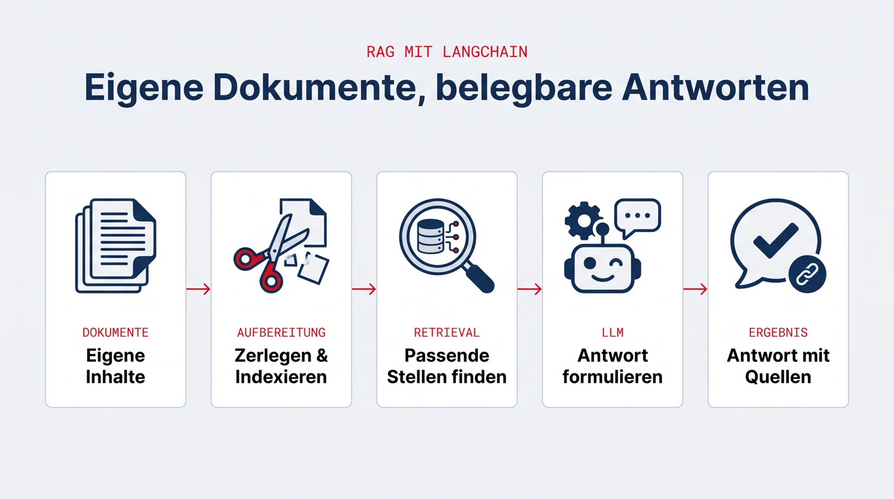

## Was ist LangChain?

LangChain ist ein Open-Source-Framework für Python, mit dem sich Anwendungen rund um große Sprachmodelle bauen lassen. Es liefert die Bausteine, die fast jede LLM-Anwendung braucht: Dokumente einlesen und zerlegen, Inhalte durchsuchbar machen (Retrieval bzw. RAG), Modelle verschiedener Anbieter einheitlich ansprechen, Werkzeuge an ein Modell anbinden und Agenten steuern.

{.infografik fig-alt="Infografik: RAG-Pipeline mit LangChain in fünf Schritten. Eigene Inhalte, Zerlegen und Indexieren, passende Stellen finden, Antwort formulieren, Antwort mit Quellen."}

## Warum es sich lohnt, das zu lernen

- **Es ist das verbreitetste Framework seiner Art.** Wer beruflich LLM-Anwendungen entwickelt, begegnet LangChain (oder seinem Agenten-Ableger LangGraph) mit hoher Wahrscheinlichkeit, in Start-ups genauso wie in Konzern-Projekten.
- **Die Konzepte zählen mehr als das Werkzeug.** Retrieval, strukturierte Ausgaben, Tool-Nutzung, Agenten, Evaluation: Wer diese Muster einmal praktisch umgesetzt hat, kann sie in jedem anderen Framework wiederverwenden.
- **Es macht den Unterschied zwischen KI benutzen und KI bauen.** ChatGPT bedienen kann jeder; eine Anwendung entwickeln, die eigene Dokumente versteht und belegbare Antworten liefert, ist die Fähigkeit, die am Arbeitsmarkt gefragt ist.

## Was Sie im Projekt damit machen

Typische Aufgaben sind das Einlesen und Strukturieren von Dokumenten, der Aufbau einer durchsuchbaren Wissensbasis (RAG) und Agenten, die ihre Antworten transparent auf Quellen zurückführen.

## Zum Vertiefen

- [LangChain-Dokumentation](https://python.langchain.com/docs/introduction/)
- [LangGraph](https://langchain-ai.github.io/langgraph/) (Agenten-Framework aus dem LangChain-Ökosystem)
