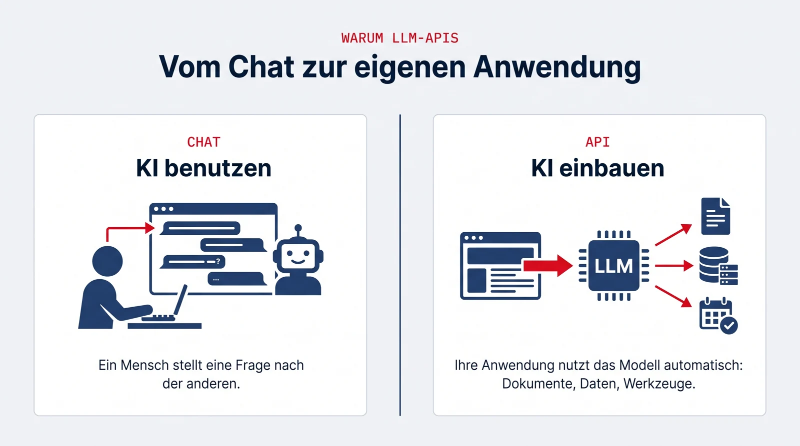

## Was sind LLM-APIs?

Große Sprachmodelle wie Claude (Anthropic), GPT (OpenAI) oder Gemini (Google) lassen sich nicht nur im Chat bedienen, sondern über Programmierschnittstellen (APIs) direkt in eigene Anwendungen einbauen. Erst darüber entstehen echte Produkte: Systeme, die Dokumente verarbeiten, strukturierte Daten liefern, Werkzeuge aufrufen und als Agenten selbstständig Arbeitsschritte ausführen.

{.infografik fig-alt="Infografik: Vergleich Chat und API. Links 'KI benutzen': ein Mensch stellt Fragen im Chat. Rechts 'KI einbauen': eine Anwendung nutzt das Modell automatisch mit Dokumenten, Daten und Werkzeugen."}

## Warum es sich lohnt, das zu lernen

- **Die API ist der Grundbaustein jeder KI-Anwendung.** Ob Chatbot, Dokumentenanalyse oder Agent: Am Anfang steht immer der Umgang mit Modell-APIs, Prompts, strukturierten Ausgaben und Tool-Aufrufen.
- **Hier trennt sich Anwenden von Entwickeln.** Den Unterschied macht, wer versteht, wie man Modelle zuverlässig, testbar und kosteneffizient in Prozesse einbaut, genau das üben Sie im Projekt an einem realen Fall.
- **Anbieterwissen veraltet, Konzepte bleiben.** Prompting, Kontextfenster, strukturierte Ausgaben, Function Calling und Evaluation funktionieren bei allen Anbietern nach denselben Prinzipien.

## Was Sie im Projekt damit machen

Die Modelle bilden den Kern der Agenten: Sie extrahieren Informationen aus Dokumenten, beantworten Fragen auf Basis der Wissensbasis und begründen ihre Vorschläge mit Quellen.

## Zum Vertiefen

- [Anthropic-Dokumentation](https://docs.anthropic.com/)
- [OpenAI-Dokumentation](https://platform.openai.com/docs/)
