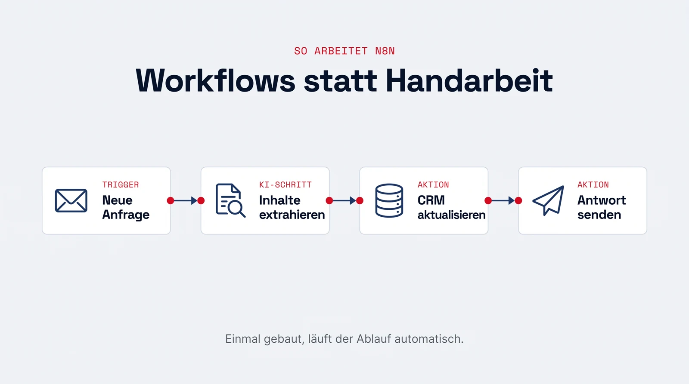

## Was ist n8n?

n8n ist ein Open-Source-Werkzeug für Workflow-Automatisierung. Sie bauen Abläufe visuell aus Bausteinen zusammen: ein Trigger startet den Workflow (z.B. eine neue E-Mail, ein Formular, ein Zeitplan), danach folgen Schritte wie Daten abrufen, umwandeln, in Systeme schreiben oder ein LLM aufrufen. Hunderte Dienste sind direkt anbindbar, von Datenbanken über CRM-Systeme bis zu den APIs von OpenAI, Anthropic und Google. Wo die Bausteine nicht reichen, ergänzen Sie eigenen Code.

{.infografik fig-alt="Infografik: Ein n8n-Workflow aus vier Bausteinen. Trigger 'Neue Anfrage', KI-Schritt 'Inhalte extrahieren', Aktion 'CRM aktualisieren', Aktion 'Antwort senden'. Einmal gebaut, läuft der Ablauf automatisch."}

## Warum es sich lohnt, das zu lernen

- **Automatisierung ist in fast jedem Unternehmen ein Dauerthema.** Wiederkehrende Abläufe (Daten übertragen, Berichte erstellen, Anfragen vorsortieren) sind genau das, was Fachabteilungen automatisiert haben wollen. Wer solche Workflows selbst bauen kann, ist unmittelbar nützlich, ohne ein ganzes Entwicklungsteam zu brauchen.
- **n8n hat sich als eines der Standardwerkzeuge für KI-Workflows etabliert**, gerade weil es sich selbst hosten lässt (relevant für Datenschutz in Unternehmen) und KI-Agenten als eigene Bausteine mitbringt.
- **Große Unternehmen setzen es bereits ein.** Zu den Referenzkunden zählen nach Firmenangaben unter anderem Mercedes-Benz, Deutsche Telekom, Microsoft, NVIDIA und Vodafone; Vodafone beziffert die Einsparung durch n8n-basierte Security-Workflows auf über zwei Millionen Pfund. Das Open-Source-Projekt gehört mit über 200.000 GitHub-Sternen zu den populärsten weltweit.
- **Die Konzepte sind übertragbar.** Wer mit n8n gearbeitet hat, versteht [APIs](../glossar.qmd#api){.glossar}, [Webhooks](../glossar.qmd#webhook){.glossar} und Datenflüsse, und damit die Grundlage jeder Systemintegration, unabhängig vom Werkzeug.

## Was Sie im Projekt damit machen

Typische Aufgaben sind Dokumenten-Pipelines (Dateien automatisch einlesen und verarbeiten), die Anbindung von Datenquellen und die Orchestrierung von KI-Agenten in einen durchgängigen Ablauf.

## Zum Vertiefen

- [n8n-Dokumentation](https://docs.n8n.io/)
- [n8n AI-Workflow-Vorlagen](https://n8n.io/workflows/categories/ai/)
