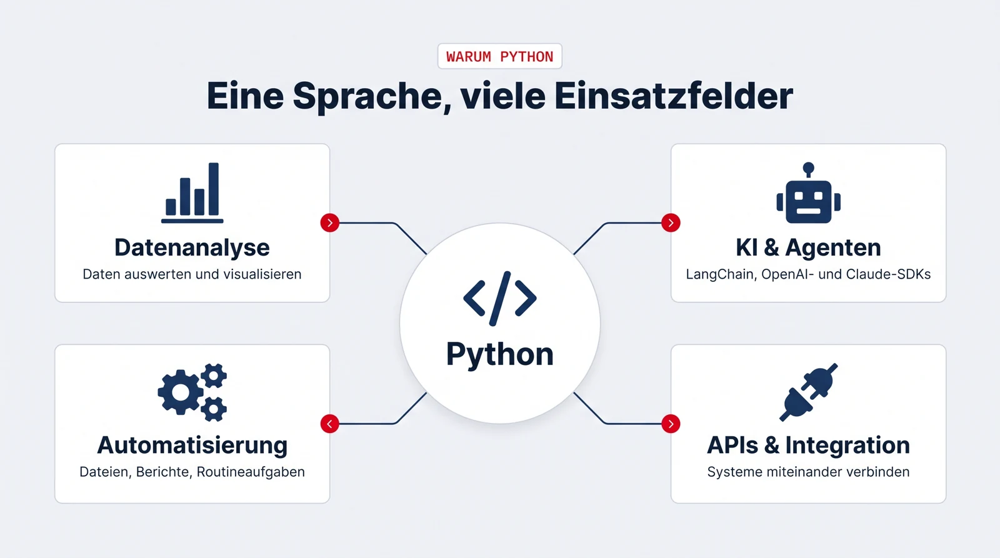

## Was ist Python?

Python ist eine Programmiersprache, die für ihre gut lesbare Syntax bekannt ist: Der Code liest sich fast wie eine Anleitung, deshalb eignet sie sich besonders gut für den Einstieg. Gleichzeitig ist sie kein Lernspielzeug, sondern die Arbeitssprache für Datenanalyse, Machine Learning und KI-Anwendungen, mit einem riesigen Ökosystem fertiger Bibliotheken für fast jede Aufgabe.

{.infografik fig-alt="Infografik: Python im Zentrum, verbunden mit vier Einsatzfeldern. Datenanalyse (Daten auswerten und visualisieren), KI und Agenten (LangChain, OpenAI- und Claude-SDKs), Automatisierung (Dateien, Berichte, Routineaufgaben), APIs und Integration (Systeme miteinander verbinden)."}

## Warum es sich lohnt, das zu lernen

- **Python ist die Standardsprache der KI.** Praktisch alle relevanten KI-Werkzeuge sind Python-first, von LangChain über die SDKs von OpenAI und Anthropic bis zu PyTorch. Wer mit KI mehr machen will als chatten, kommt an Python nicht vorbei.
- **Es ist seit Jahren die populärste Programmiersprache der Welt.** In den gängigen Rankings (z.B. TIOBE, IEEE Spectrum) steht Python auf Platz 1, entsprechend groß sind Community, Lernmaterial und Nachfrage am Arbeitsmarkt.
- **Der Einstieg lohnt sich auch ohne Entwickler-Ambitionen.** Schon wenige Zeilen Python reichen, um Daten auszuwerten, Dateien zu verarbeiten oder eine API anzusprechen, Fähigkeiten, die in fast jedem Fachbereich nützlich sind.

## Was Sie im Projekt damit machen

Python ist die Sprache, in der die Prototypen entstehen: Skripte für die Datenverarbeitung, die Logik der Agenten und die Anbindung der LLM-APIs. Sie schreiben dabei keinen Produktionscode auf Konzernniveau, sondern lernen, mit Python Ideen schnell in funktionierende Anwendungen zu übersetzen.

## Zum Vertiefen

- [Offizielles Python-Tutorial](https://docs.python.org/de/3/tutorial/index.html) (deutsch)
- [Real Python](https://realpython.com/) (Tutorials für Einsteiger bis Fortgeschrittene)
